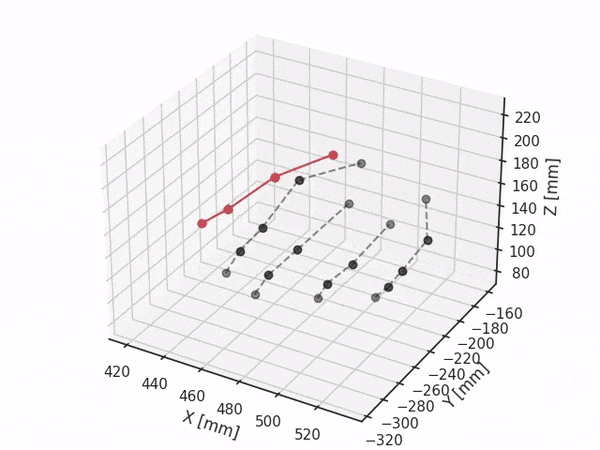
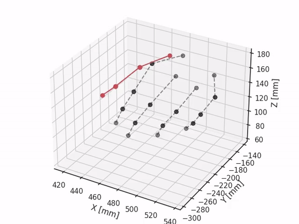
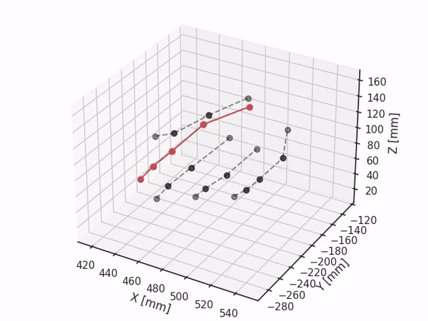
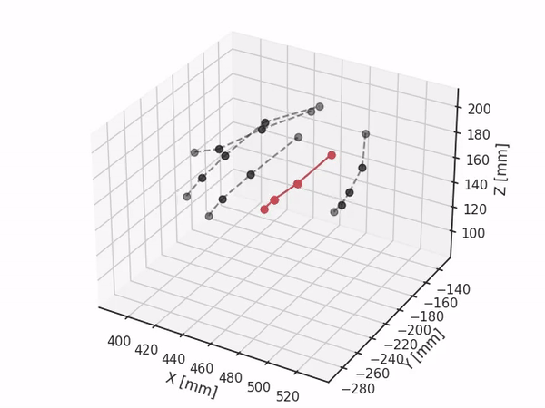
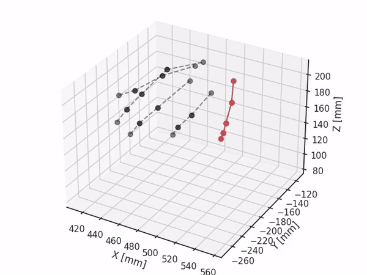

# Leap_and_Motion_Capture

Paper Title: <b>Comparison of the performance of the Leap Motion ControllerTM with standard marker-based motion capture system</b> 
Journal    : <b>Sensors (https://www.mdpi.com/1424-8220/21/5/1750)</b> 
Authors    : <b>Amartya Ganguly1*, Gabriel Rashidi1, and Katja Mombaur2 </b> 

1. Optimization, Robotics and Biomechanics, Institute of Computer Engineering, Heidelberg University, 69120,Heidelberg, Germany 
2. Canada Excellence Chair in Human-Centred Robotics and Machine Intelligence, University of Waterloo,Waterloo, ON N2L 3G1, Canada.;
katja.mombaur@uwaterloo.ca 
*Correspondence: amartya.ganguly@ziti.uni-heidelberg.de 

# Repository overview
All raw data files are stored in *Dynamic* (flexion trials) and *Static* folder.

The *code* folder contains data extraction and processing. The names of the files are self-explanatory 

# Leap Motion Controller
All relevant information regarding Leap development SDK can be found here. 
https://developer-archive.leapmotion.com/documentation/python/index.html

A quick introduction on how to conncect the Leap Motion Controller and output the data can be found here: 
https://developer-archive.leapmotion.com/documentation/python/devguide/Sample_Tutorial.html  
Parts of the code snippets like the *SampleListener* Class, the *main* function as well as the *on_frame* function are also used in this code.  
The following gives you brief overview of the synchronisation code provided in this repo: 
<ul>
  
  <li>main code block</li>
  <ul>
    <li> this part updates the file counter for the runs and prints the header of the text files 
    <li> produces two folders: processed and postProcessed 
    <li> processed folder contains the data which has the 1 set in the status_qtm column 
    <li> postProcessed folder contains data sorted by finger names</li>
  </ul>
  
  <li> <em>main</em> function</li>
  <ul>
    <li> creates listener and contoller instances; controls the program exit; press enter to stop and exit from the while loop  
    <li> sets the policy of the Leap Controller to background so the data acquisition can continue while other programs run</li>
  </ul>
  
  <li> <em>SampleListener</em> class</li>
  <ul>
    <li> <em>on_connect</em>: prints conncected when your leap device connects succesfully</li>
    <li> <em>on_frame</em>: fetches the data of each frame and writes them into separate textfiles for both hands each 
      Textfiles for each run will be put into the rawData folder and named lefthand <b>N</b> and righthand <b>N</b>, where, <b>N</b> is the counter refering to the runs starting at 1</li>
      </ul>
      
  <li> <em>Server</em> class</li>
  <ul>
    <li> implements a background server on a second thread which runs parallel to the main program and listens on a UDP socket to incoming events from QTM on port 8888, which is the default port of QTM sending out data</li>
    <li> default interface the is the loopback interface which refers to the machine this servers on</li>
    <if no parameters are given the program will use default confgurations</li>
    <li> the server is responsible for updating the global <em>status_qtm</em> variable which gets written into the output textfile and indicates the intervals in which QTM was capturing data while running the Leap Motion Controller</li>
    <li> this intervalls are consecutive leap data frames which have a 1 in their status_qtm column</li>
  </ul>
  
  <li> <em>sortFingersByName</em></li>
  <ul>
    <li> sorts the fingers by name in this order: Thumb, Index, Middle, Ring, Pinky. This is required for plotting procedures.</li>
  </ul>
  
  <li> <em>sanitiseArray</em></li>
  <ul>
    <li> removes opening and closing brackets from (x, y, z) tuples </li>
  </ul>
  
</ul>
  

Running the script and QTM on the same machine
------------------------------------------
Script depends on Python2 code. Run it by starting the Windows Powershell and the command: python2 leapDataExtraction.py

The script takes an optional parameter, the IP address of the network interface of the machine which runs the QTM programme. By default, it is set to the loop-back interface. 

Running the script and QTM on different machines
--------------------------------------------
However, to run this script on a different machine from which QTM is running, then the script needs the IP address of the machine which runs QTM. Eduroam does not allow unathorized UDP-SocketStreams. Log in the machine into a different WiFi, e.g. Heidelberg4You. Obtain the IP address when using the Windows Commandline (cmd) on the machine running QTM and run the command: ipconfig. 

Obtain IPv4-address from the WiFi interface and give it as a string argument to the script (python2 leapDataExtraction.py "IPv4 address from WiFi interface"). The server of the script will listen to this interface and run the script and QTM on the same machine. 

Warning: The machines logged in into the public WiFis will log out after some time automatically so before you start your measurement check if you are still connected to the public WiFi. (in case of public WIFI).

Examples of dynamic movements of one subject
--------------------------------------------

| Thumb flexion | Thumb abduction |
| ------------- | ------------- |
|   |  |

| Index flexion | Middle flexion|
| ------------- | ------------- |
|   | |

| Ring flexion | Pinky flexion |
| ------------- | ------------- |
  |  |

Funding
-------

This project was funded by <b>EIT Health under grant id: 19340</b>

Cite this work
--------------
MDPI and ACS Style
Ganguly, A.; Rashidi, G.; Mombaur, K. Comparison of the Performance of the Leap Motion ControllerTM with a Standard Marker-Based Motion Capture System. Sensors 2021, 21, 1750. https://doi.org/10.3390/s21051750

AMA Style
Ganguly A, Rashidi G, Mombaur K. Comparison of the Performance of the Leap Motion ControllerTM with a Standard Marker-Based Motion Capture System. Sensors. 2021; 21(5):1750. https://doi.org/10.3390/s21051750

Chicago/Turabian Style
Ganguly, Amartya; Rashidi, Gabriel; Mombaur, Katja. 2021. "Comparison of the Performance of the Leap Motion ControllerTM with a Standard Marker-Based Motion Capture System" Sensors 21, no. 5: 1750. https://doi.org/10.3390/s21051750

Shield: [![CC BY 4.0][cc-by-shield]][cc-by]

This work is licensed under a
[Creative Commons Attribution 4.0 International License][cc-by].

[![CC BY 4.0][cc-by-image]][cc-by]

[cc-by]: http://creativecommons.org/licenses/by/4.0/
[cc-by-image]: https://i.creativecommons.org/l/by/4.0/88x31.png
[cc-by-shield]: https://img.shields.io/badge/License-CC%20BY%204.0-lightgrey.svg
